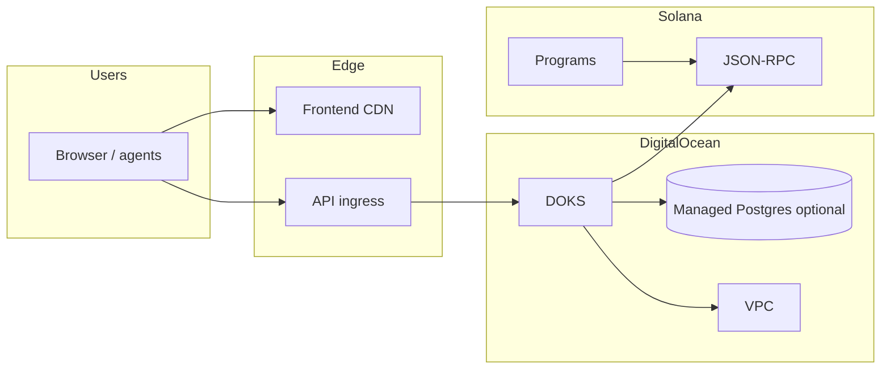

# Deployment, observability, and cost controls

This guide matches the current stack: FastAPI backend on Kubernetes (DigitalOcean), optional Vercel frontend, Anchor programs on Solana devnet/mainnet, and the local Docker Compose developer stack.

## Architecture



## Infrastructure as code (Terraform)

Path: `infra/terraform`.

1. Install [Terraform](https://www.terraform.io/) and [doctl](https://docs.digitalocean.com/reference/doctl/).
2. Export `DIGITALOCEAN_TOKEN` (or pass `-var="do_token=..."`).
3. Run:

```bash
cd infra/terraform
terraform init
terraform plan -var="do_token=$DIGITALOCEAN_TOKEN"
terraform apply -var="do_token=$DIGITALOCEAN_TOKEN"
```

Notable variables:

- `enable_managed_postgres` — default `false` to avoid surprise spend; set `true` when you want a private VPC-attached Postgres cluster and firewall rule for the Kubernetes cluster.
- `enable_do_project` — default `false`; enable to create/link a DigitalOcean Project.
- `monthly_budget_alert_usd` — documented soft cap; **set the real billing alert** in [DigitalOcean billing](https://cloud.digitalocean.com/account/billing) (email alerts when projected spend exceeds your threshold).

Outputs include the Kubernetes cluster id for:

```bash
doctl kubernetes cluster kubeconfig save "<cluster-name>"
```

## Application deployment (existing CI)

- `.github/workflows/deploy.yml` — frontend build, backend image to GHCR, `kubectl set image` to `deployment/solfoundry-backend` in namespace `production`, Alembic migrations.
- `.github/workflows/deploy-devnet.yml` — Anchor build/test/deploy; after deploy runs `scripts/verify-devnet-programs.sh` to assert each `[programs.devnet]` entry resolves on-chain.

## Rollback

- **Kubernetes API**: `./scripts/k8s-rollback-backend.sh [namespace]` — `kubectl rollout undo` for `solfoundry-backend`.
- **Anchor programs**: `./scripts/anchor-program-rollback.sh <git-ref>` — checks out a known-good ref, runs deploy + verification, then returns to the previous `HEAD`. Requires a clean working tree.

## Horizontal scaling

Apply `infra/k8s/hpa-backend.yaml` after [metrics-server](https://github.com/kubernetes-sigs/metrics-server) is installed on the cluster. The node pool in Terraform uses `auto_scale` with `min_nodes` / `max_nodes` for worker capacity.

## Observability stack (Docker)

Path: `monitoring/`.

1. Start the app stack from the repo root so the default network is created (typically `solfoundry_default`):

```bash
docker compose up -d --build
```

2. If the network name differs, create it explicitly: `docker network create solfoundry_default`.

3. Start monitoring:

```bash
docker compose -f docker-compose.yml -f monitoring/docker-compose.observability.yml up -d
```

Defaults:

- Grafana: `http://localhost:3001` (override `GRAFANA_ADMIN_PASSWORD`).
- Prometheus: `http://localhost:9090`.

### What gets monitored

| Area | Mechanism |
|------|-----------|
| Service uptime / latency | Blackbox probes (`/health`, optional public URLs) + Prometheus `probe_*` |
| Solana RPC | Blackbox `http_post_jsonrpc` to your RPC; plus backend gauge `solfoundry_solana_rpc_up` from `getHealth` |
| DB pool | Backend `/metrics` gauges `solfoundry_db_pool_*` |
| Queue depth | Redis list lengths for keys listed in `OBSERVABILITY_REDIS_QUEUE_KEYS` (comma-separated); metric `solfoundry_redis_queue_length{queue="..."}` |
| Logs | Promtail → Loki; explore in Grafana (dashboard + Explore) |

Backend environment variables:

- `OBSERVABILITY_ENABLE_BACKGROUND` — default `true` in production; tests set `false`.
- `OBSERVABILITY_REFRESH_SECONDS` — default `15`.
- `OBSERVABILITY_REDIS_QUEUE_KEYS` — optional; example: `review:queue,events:pending`.

**Production note:** restrict `/metrics` at the ingress or network policy so only Prometheus can scrape it.

### Alerting

Edit `monitoring/alertmanager/alertmanager.yml`. Uncomment and configure Slack, Telegram, or PagerDuty receivers (examples are in-file). Replace the placeholder `webhook_configs` URLs with real integrations.

PagerDuty: create a Prometheus integration and use `pagerduty_configs.service_key` (routing key).

### Uptime probes

Edit `monitoring/prometheus/prometheus.yml` blackbox `targets` to include your public API and site URLs.

### Cost monitoring

- DigitalOcean: billing alerts in the control panel; tag resources via Terraform `tags`.
- Optionally run [Infracost](https://www.infracost.io/) against `infra/terraform` in CI for pull-request cost deltas.

## Database backups

- **Backup:** `DATABASE_URL=postgresql://... ./scripts/postgres-backup.sh ./backups`
- **Tested restore:** `./scripts/postgres-restore-test.sh ./backups/solfoundry-....sql.gz` (starts a throwaway `postgres:16` container, restores, runs `SELECT 1`).

Use managed-database snapshots when on DigitalOcean Managed Postgres in addition to logical dumps.

## Solana program upgrades (safe flow)

- **Script:** `./scripts/anchor-program-upgrade.sh` — wraps `scripts/deploy-devnet.sh` and `scripts/verify-devnet-programs.sh`.
- **CI:** devnet workflow verifies programs after every deploy (see `verify-devnet-programs.sh`).

## Related runbook

See `docs/runbooks/incident-response.md` for common failure modes and escalation paths.
